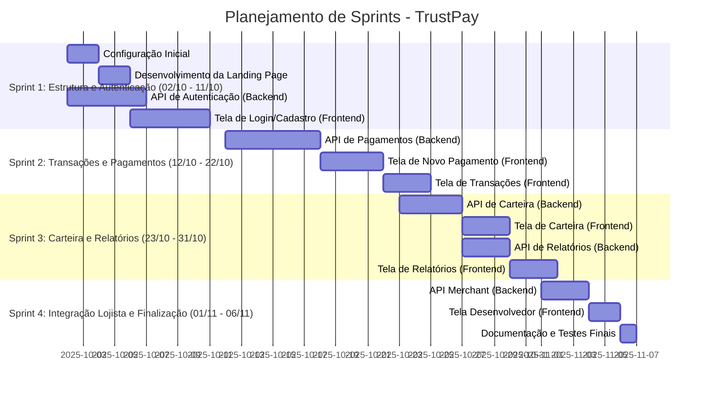

# TrustPay - Frontend (Angular)

O frontend do TrustPay é uma aplicação web robusta desenvolvida em **Angular**, utilizando **TypeScript** para tipagem forte e **RxJS** para gerenciamento de estado reativo. A interface do usuário é construída com **Angular Material** e **Bootstrap**, garantindo um design moderno e responsivo.

## 🚀 Tecnologias Utilizadas

| Categoria | Tecnologia | Versão Principal | Descrição |
| :--- | :--- | :--- | :--- |
| **Framework** | Angular | 20.3.x | Plataforma para construção de aplicações web. |
| **Linguagem** | TypeScript | 5.9.x | Superset do JavaScript que adiciona tipagem estática. |
| **Estilo/UI** | Angular Material | 20.2.x | Componentes de UI de alta qualidade baseados no Material Design. |
| **Estilo/Layout** | Bootstrap | 5.3.x | Framework CSS para desenvolvimento responsivo. |
| **Reatividade** | RxJS | 7.8.x | Biblioteca para programação reativa. |
| **Gráficos** | Chart.js / ng2-charts | 4.5.x / 8.0.x | Visualização de dados e relatórios. |
| **Relatórios** | jspdf / jspdf-autotable | 2.5.x / 3.8.x | Geração de relatórios em PDF. |
| **Testes** | Jasmine / Karma | 5.9.x / 6.4.x | Ferramentas para testes unitários. |

## 🗺️ Estrutura de Rotas

A aplicação utiliza o Angular Router para gerenciar a navegação, implementando *Guards* (`authGuard` e `merchantGuard`) para proteger rotas e garantir que apenas usuários autenticados ou lojistas específicos possam acessá-las.

| Rota | Componente | Proteção | Descrição |
| :--- | :--- | :--- | :--- |
| `/` | `HomeComponent` | Nenhuma | Página inicial pública. |
| `/auth` | `AuthComponent` | Nenhuma | Tela de login e autenticação. |
| `/dashboard` | `DashboardComponent` | `authGuard` | Visão geral e principal painel do usuário. |
| `/payment/:id` | `PaymentComponent` | Nenhuma | Página de pagamento (acessível via link de transação). |
| `/novo-pagamento` | `NewPaymentPage` | `authGuard` | Formulário para iniciar um novo pagamento. |
| `/relatorios` | `ReportsPage` | `authGuard` | Visualização e geração de relatórios. |
| `/transacoes` | `TransactionsPage` | `authGuard` | Histórico e detalhes das transações. |
| `/carteira` | `WalletPage` | `authGuard` | Gerenciamento da carteira digital. |
| `/configuracoes` | `SettingsPage` | `authGuard` | Configurações gerais da conta. |
| `/desenvolvedor` | `DeveloperPage` | `authGuard`, `merchantGuard` | Área para desenvolvedores e lojistas (APIs, webhooks). |
| `/documentacao` | `DocumentacaoPage` | `authGuard` | Documentação interna da aplicação. |
| `/minha-conta` | `SettingsPage` | `authGuard` | Atalho para a página de configurações da conta. |

## ⚙️ Instalação e Execução

Este projeto utiliza o **npm** como gerenciador de pacotes.

### Pré-requisitos

*   Node.js (versão compatível com Angular 20)
*   npm

### Passos

1.  **Instalar dependências:**
    ```bash
    npm install
    ```

2.  **Executar o servidor de desenvolvimento:**
    ```bash
    npm start
    # ou
    ng serve
    ```
    O aplicativo será iniciado em `http://localhost:4200/`.

3.  **Compilar para produção:**
    ```bash
    npm build
    ```
    Os artefatos de *build* serão armazenados no diretório `dist/`.

## 🖼️ Telas da Aplicação

As telas a seguir ilustram a interface do usuário e as funcionalidades do TrustPay, com destaque para as diferenças entre os perfis de **Lojista** e **Pessoa Física**.

### 1. Página Inicial e Login

| Tela | Descrição |
| :--- | :--- |
| **Página Inicial** | A tela de *landing page* apresenta os principais benefícios do TrustPay: segurança, pagamentos instantâneos e suporte 24h. É o ponto de entrada para novos usuários. |
|  | |
| **Login** | Tela de autenticação unificada para ambos os perfis. Permite o acesso via e-mail/celular e senha, além da opção de criar uma nova conta. |
|  | |

### 2. Dashboard (Perfil)

| Tela | Perfil | Descrição |
| :--- | :--- | :--- |
| **Dashboard (Lojista)** | **Lojista** | Exibe o perfil da empresa (`OrtizPassos Ltda`), cartões salvos e um resumo das **Transações Recentes**. O menu lateral inclui a opção **Developer** (Desenvolvedor), exclusiva para lojistas. |
|  | |

### 3. Novo Pagamento

| Tela | Perfil | Descrição |
| :--- | :--- | :--- |
| **Novo Pagamento** | **Comum a ambos** | Formulário para iniciar uma nova transação. Requer o e-mail do destinatário, valor, método de pagamento (Cartão de Crédito) e opções de parcelamento. |
|  | |

### 4. Relatórios e Transações

| Tela | Perfil | Descrição |
| :--- | :--- | :--- |
| **Relatórios de Transações** | **Comum a ambos** | Permite a busca de transações por período. |
|  | |
| **Transações** | **Comum a ambos** | Lista detalhada das transações, com filtros por Status, Método e Direção (Recebido/Pago). Inclui a opção de **Exportar PDF**. |
|  | |

### 5. Carteira

| Tela | Perfil | Descrição |
| :--- | :--- | :--- |
| **Carteira** | **Comum a ambos** | Exibe o **Saldo Disponível** e o valor **A Receber (Pendentes)**. Inclui um gráfico de barras para visualização dos recebimentos mensais. |
|  | |

### 6. Configurações da Conta

| Tela | Perfil | Descrição |
| :--- | :--- | :--- |
| **Configurações da Conta** | **Comum a ambos** | Tela para atualização dos dados cadastrais (Nome, Sobrenome, Email, Telefone). A aba "Configurações da sua loja TrustPay" sugere que o formulário pode se adaptar para incluir dados específicos de pessoa jurídica. |
|  | |

### 7. Área do Desenvolvedor (Exclusivo Lojista)

| Tela | Perfil | Descrição |
| :--- | :--- | :--- |
| **Developer** | **Lojista** | Área crucial para integração. Contém a documentação de como usar a **API TrustPay**, os **Endpoints essenciais** e uma ferramenta para **Visualizar Chaves Merchant** e gerar *Headers* e *Payloads* de teste. |
|  | |

***

*Este README foi gerado automaticamente por Manus AI.*

## 🗓️ Planejamento do Projeto (Gráfico de Gantt)

O planejamento a seguir é uma proposta de divisão do projeto em Sprints, baseada nas funcionalidades identificadas no frontend e backend.



***


